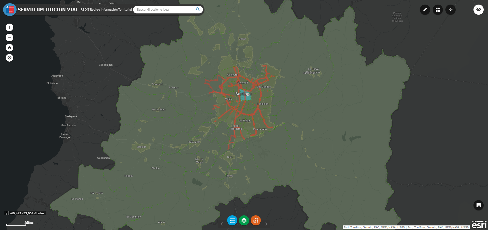
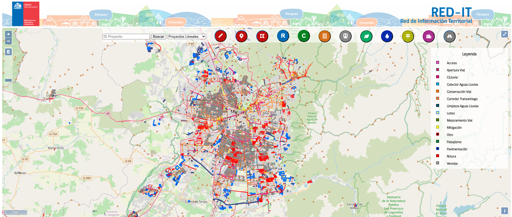

# Introducción

El presente documento tiene por objetivo definir un marco de trabajo mínimo estandarizado para el desarrollo de mapas web en la Sección de Georreferenciación, con el fin de asegurar coherencia, calidad y sostenibilidad en los productos que se desarrollen e implementen. 

Este marco de trabajo establecerá lineamientos claros que permitan: 

- Homogeneizar la experiencia de usuario, asegurando criterios comunes de visualización, interacción y navegación. 

- Unificar la estructura técnica y lógica de desarrollo, promoviendo buenas prácticas en arquitectura, componentes, uso de librerías y manejo de datos. 

- Facilitar el mantenimiento, escalabilidad y reutilización de los desarrollos, reduciendo la dependencia de soluciones ad-hoc o individuales. 

- Asegurar que los mapas web cumplan con estándares técnicos y funcionales mínimos, acordes a los requerimientos institucionales y a las capacidades del equipo. 

## Alcance

Este proyecto surge a partir de la necesidad de visualizar y disponibilizar de manera eficiente la información espacial del sistema REDIT mediante mapas web funcionales, claros y orientados a responder requerimientos específicos de análisis, gestión y toma de decisiones. 

Actualmente, la Sección de Georreferenciación cuenta con distintas soluciones de visualización de información espacial, las cuales presentan limitaciones relevantes: 

**Mapas desarrollados en ArcGIS Online**: 
Si bien permiten una visualización rápida de la información, su uso se encuentra restringido por no contar con administración completa de la plataforma. A esto se suma la dependencia del consumo de créditos para funcionalidades avanzadas y la imposibilidad de integrar información publicada en GeoServer de forma dinámica y en tiempo real. 

 

**Mapas desarrollados en OpenLayers por un proveedor externo**: 
Estos productos cumplen parcialmente con los requerimientos técnicos, ya que consumen servicios WFS; sin embargo, presentan una usabilidad deficiente, una interfaz poco amigable y una baja capacidad de adaptación a nuevos requerimientos, lo que ha limitado su uso y masificación. 

 

 

 

En este contexto, y considerando que actualmente el equipo cuenta con los conocimientos técnicos necesarios para desarrollar mapas web, se hace imprescindible establecer un marco de trabajo común que permita ordenar, estandarizar y profesionalizar estos desarrollos. 

El objetivo principal de este proyecto es definir un conjunto de lineamientos y estándares mínimos que orienten el desarrollo de mapas web, abordando aspectos como: 

- Seguridad y acceso a la información. 

- Homogeneización visual y funcional. 

- Estructura de desarrollo y buenas prácticas técnicas. 

- Limpieza, mantenimiento y escalabilidad de los productos. 

- Definición de un layout o interfaz base que garantice una experiencia de usuario coherente. 

Este marco de trabajo busca servir como referencia transversal, aplicable tanto a desarrollos internos como a eventuales trabajos realizados por terceros, asegurando consistencia, calidad y sostenibilidad en el tiempo. 

## Objetivos

### General 

- Definir e implementar un marco de trabajo mínimo estandarizado para el desarrollo de mapas web, que permita asegurar coherencia técnica, visual y funcional en los productos desarrollados por la Sección de Georreferenciación, facilitando futuras ampliaciones y estableciendo las bases para un ecosistema de desarrollo sostenible y colaborativo. 

### Específicos 

- Establecer un layout base para todos los mapas web, incluyendo lineamientos visuales mínimos (tipografía, colores, disposición general y controles esenciales). 
- Definir un flujo de trabajo estándar para el desarrollo y revisión de mapas web, utilizando control de versiones (GIT) y validaciones técnicas. 
- Documentar una arquitectura y estructura mínima de desarrollo, definiendo la organización de carpetas, componentes y responsabilidades del código. 
- Seleccionar y formalizar el stack tecnológico inicial recomendado para el desarrollo de mapas web en la Sección. 
- Definir criterios mínimos de accesibilidad y usabilidad, asegurando el cumplimiento de estándares esenciales (AA). 
- Establecer lineamientos básicos de seguridad y manejo de accesos, acordes al contexto actual de infraestructura. 
- Formalizar el consumo mínimo estándar de servicios geoespaciales desde GeoServer (WMS, WFS, WMTS), asegurando coherencia entre mapas. 
- Definir los requerimientos mínimos de documentación de cada mapa web, incluyendo guía de uso básica y referencias técnicas esenciales. 
- Consolidar todos estos elementos en un documento estructurado, utilizando una herramienta de documentación como Docusaurus que permita mantener un ciclo de actualización controlado. 